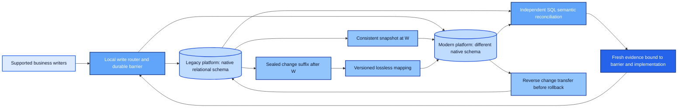

# MarTech Migration Assurance

**Can we replace a customer platform without losing data meaning—and still roll back after the new system receives writes?**

This executable lab migrates a small synthetic customer platform between two different relational schemas. It captures changes during a consistent snapshot, proves semantic parity, blocks unsafe cutover, and reverses post-cutover changes before moving writes back.

**Start with the [generated migration report](docs/evidence/report.md).** The most revealing failure has equal record counts and matching log positions: a destination turns an unknown subscription into false. Reconciliation identifies the exact field and blocks the switch. A separate experiment shows why rollback must stop when the new platform accepts a lifecycle value the old one cannot represent.

This fourth portfolio project adds **system replacement and migration assurance**. It complements analytical truth, authoritative customer state and agent evaluation without rebuilding them. The [portfolio decision](docs/decision.md) compares three directions against the current role priorities and records the inspected public commits.



## What runs

The default demonstration uses **six fictional organizations and 120 fictional people**, not a claimed production volume. Legacy and modern platforms have separate SQLite files, native tables, atomic change logs and request receipts. A third small file stores the write route, cutover barrier and evidence history. Python's standard library is the complete runtime dependency set.

The implementation preserves stable source IDs, relationships, Unicode names, lifecycle states, bounded scores, channel sets, three-valued subscription state and a versioned locale field. It does not perform identity resolution, determine legal consent, send campaigns or connect to a real CRM.

| Engineering question | Executed proof |
|---|---|
| Do writes during snapshot export disappear? | A source update/delete/insert commits between export pages; the pinned baseline plus complete suffix restores parity |
| Can schema changes silently lose fields? | Mapping v1 rejects a v2 locale change without advancing its checkpoint; mapping v2 resumes the same batch |
| Can correct counts hide wrong meaning? | Independent SQL catches subscription, lifecycle, channel and score mutations despite equal counts/cursors |
| Can a passing report become stale? | Activation recomputes current evidence and rejects changed data, code or barrier epoch |
| Does an interrupted transfer skip or duplicate data? | Actual subprocess exits before/after commit; reopen and retry preserve data, receipts and checkpoint together |
| Does rollback preserve new-system writes? | Reverse catch-up transfers them before routing back; retry returns the original receipt |
| Is rollback always possible? | A modern-only lifecycle blocks reverse mapping; abort resumes modern without discarding the value |

## Reproduce

Use Python **3.12**, from the extracted repository root:

```bash
python -m venv .venv
# Activate .venv for your shell.
python -m pip install -r requirements.lock
python -m pip install --no-deps --no-build-isolation -e .
python scripts/verify.py
```

Verification runs lint, dependency checks, software tests, two actual process-crash experiments and the asserted migration demonstration. It regenerates [evidence](docs/evidence/report.md), [test results](docs/evidence/tests.xml), [crash results](docs/evidence/crashes.json) and a [source-hashed verification record](docs/evidence/verification.json). Each run creates a fresh ignored working directory; no existing operator database is reset. No Docker, paid API or cloud account is required.

For just the migration story: `python scripts/demo.py`. The verification command also generates the linked crash evidence. [Operations](docs/operations.md) explains how to inspect and extend individual transitions.

## Scope of the result

This is an independent synthetic portfolio implementation by Richard Butts. Native Windows execution is demonstrated. Hosted GitHub Actions verification also passed on both Windows and Ubuntu for the published build. No cloud deployment, Salesforce/Data Cloud integration, production traffic, security certification or enterprise SLA is claimed.

The protocol deliberately pauses writes for final reconciliation. It is **not a zero-downtime migration guarantee**. All supported writers use the local coordinator; direct database administrators are outside its fencing boundary. Long snapshots, retained change logs, full in-memory comparison and a single-host router limit scale. Real vendor migration needs adapter-specific snapshot, deletion, retention, transaction and fencing guarantees.

Read the [architecture and mapping contract](docs/architecture.md), [operating procedure](docs/operations.md), and [skeptical review, evidence and limitations](docs/validation.md).

The [finished project handoff](docs/handoff.md) summarizes the selection, executed results and publication record.
